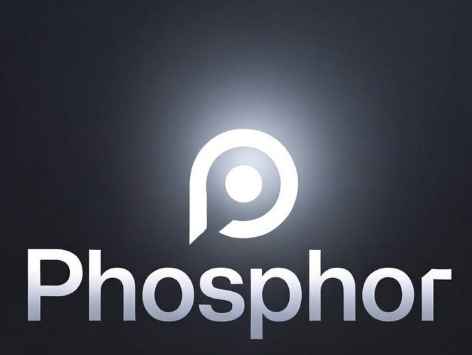

## An Experiment in AIdaptive UIs

A handheld computer where an LLM draws the next screen as HTML/JS. You talk. It listens. The screen that appears is whatever the moment calls for.

That's it. That's the whole idea.

I built this because I got tired of the modern smartphone. Not the hardware — the hardware is fine. The model is broken. An operating system that hides everything behind icons you have to remember, arranged in a grid that some unimaginative arrogant slob at Google/Apple decided was the right metaphor for the seventeenth year in a row. Notifications designed by narcissists who hate you. Apps that demand permissions to spy on you. Forty-seven settings menus, none of which let you do the one thing you actually opened the app to do.

The web won. It won twenty years ago. HTML, CSS, and JavaScript are the most deployed runtime in the history of computing. Every phone in your pocket ships with a faster browser than most laptops had in 2010. And we're still pretending the answer to "what should the home screen be?" is a folder of oversaturated jpegs you have to swipe past.

Phosphor is my answer. The home screen is whatever I need in the moment. Sometimes it's a button to call your mom. Sometimes it's a weather card with the next six hours. Sometimes it's a settings page because you asked it to turn off the ringer. The browser renders it. There is no home screen. There is no app grid. There is no keyboard... There is a microphone, a model, and a black screen that fills with whatever makes sense.

## Status: two builds, one lesson set

**The iOS app (this repo's `ios/` + `ios-app/`) is the proof of concept.** It works — voice loop, generative screens, native approval cards, App Store-grade build pipeline via GitHub Actions — and it taught us everything that matters. Its final form is on TestFlight. Do not judge the project by Apple's constraints; judge it by what the experiment proved:

- Generative UI works. An LLM drawing screens on demand is usable at one-second latency.
- Voice-first is real. No keyboard anywhere in the loop.
- The trust architecture (see `docs/PHOS-SPEC-001`) survives independent audit.

**The real product runs on a Pixel 8a with GrapheneOS** — see `PHOSPHOR_SPEC.md` for the full build guide and `docs/ANDROID.md` for the current plan. Android is where the thesis lands: no Apple sandbox, a real bridge to the modem/GPS/NFC/camera, and a thin WebView app as the only interface.

## How it actually works

Three pieces. That's all.

**A Pixel 8a running GrapheneOS.** Picked because Google's Tensor G3 NPU actually runs local LLMs at usable speed, and GrapheneOS gives me a base I can verify — no Google Play Services, no bloat I didn't install, no telemetry phoning home. Make sure you check the model number first because Verizon Pixels have a permanently-locked bootloader and I refuse to live under anyone's thumb on a device I bought.

**A Rust binary that talks to the OS.** Phosphor's bridge is six hundred lines of Rust, it runs as root, binds `127.0.0.1:7777`, and exposes a JSON-RPC API. That's it. Every device capability — the modem, the GPS, the camera, NFC, Bluetooth, USB, the battery thermals, the clipboard — comes through as a method call. `tel.dial`. `geo.fix`. `battery.read`. No magic. No SDK. You could rewrite it in Python over a weekend if you really wanted to.

**A thin WebView app.** An Android app (Kotlin, tiny — the iOS app's skeleton ported) whose entire job is to fullscreen a WebView, own the bridge process, and hold the native pieces the browser can't: the auth token, the approval dialog, the hardware bridge supervision. The WebView loads `app-shell.html` — one static file that talks to the bridge over a WebSocket and to the server over HTTPS. When the model responds, it sends back HTML. The page swaps it in. No router. No state library. No bundler. (Earlier drafts used a kiosk-locked Vanadium tab; the app approach won — fewer kiosk hacks, native approval dialog, reliable autostart, and the same hardened Vanadium engine underneath via GrapheneOS's system WebView.)

```
   you ──► whisper (STT) ──► LLM ──► HTML/CSS/JS ──► WebView app
                                       ▲
                                       │
                       device APIs ◄───┘
                       (cell, GPS, NFC, sensors, BT, USB, camera, mic)
                               via WebSocket to a Rust bridge
```

### What the iOS proof-of-concept taught us (hard-won, applies to Android)

Everything below is battle-tested and shipped in the iOS build; the Android shell must inherit all of it. Full detail in `docs/PHOS-SPEC-001-trust-architecture.md` and the four audit reports in `docs/`.

- **Trust architecture.** Untrusted web content (search results, fetched pages) is quarantined in labeled envelopes; every tool result is scanned for injection markers; destructive shell commands are classified by a fail-closed pattern engine and require a human tap before execution (native approval card, server-verified content — page text can't spoof the card). Four independent code audits, ~35 findings, all remediated.
- **Secrets never enter page scope.** The auth token lives in native storage; page JS talks to the server through a native proxy. Stale tokens are purged from page storage at boot. Secrets are redacted before conversation histories hit disk.
- **Screens run JS — carefully.** `innerHTML` does not execute `<script>` tags; the shell re-creates them, IIFE-wrapped with function declarations hoisted to `window` (so screens can't collide with each other or the shell). External `<script src>` is blocked — subresource loads bypass navigation allowlists.
- **The interface talks to one brain.** Both front-ends (iOS app, Telegram bot) share one agent core; rules apply identically everywhere. The Android shell plugs into the same core.
- **Model choice matters.** Benchmarked six OpenRouter models on the real workload: speed without quality is worthless. Current: `google/gemini-2.5-flash`.

## What it isn't

Phosphor is not a product. It's a personal project I'm open-sourcing because other people might want to live this way too, and because the next ten years of personal computing are going to be defined by this kind of thing whether we admit it or not.

It is not a phone you can buy. You build it from a Pixel 8a and an afternoon.

It does not have an app store. There are no apps. There is the AI and what you need in the moment.

If it goes offline: the bridge will fall back to a local llama.cpp build when the network is gone, but the local models aren't good enough to replace the cloud ones yet. They will be. Today the cloud path is the good path.

## Cost

What the iOS proof-of-concept actually cost: an Apple Developer account and GitHub Actions minutes. What the Pixel build costs:

| Item | Cost |
|---|---|
| Pixel 8a 128GB, factory unlocked, refurb | ~$215 |
| USB-C cable + 30W charger + case | ~$45 |
| OpenRouter + Whisper (12 months at my usage) | ~$150 |
| **Total** | **~$410** |

No subscription. No in-app purchase. The phone is mine. The model calls go to OpenRouter so check to make sure the model you use, uses your data in a way that you can live with, and that's the end of it.

## Getting it running

See `PHOSPHOR_SPEC.md` for the complete Pixel 8a + GrapheneOS walkthrough (web installer, ~20 minutes, no command line), `docs/ANDROID.md` for the build plan and current next steps, and `docs/` for the trust-architecture spec, verification report, and the independent audit reports.

The iOS proof-of-concept: `ios/` (Swift app) + `ios-app/` (bundled web shell) + `.github/workflows/build-ios.yml` (Mac-less CI). Builds sign and upload to TestFlight automatically.

## The system prompt is the product

The single most important file in this repo is not the Rust. It's `SYSTEM_PROMPT.md`.

Everything Phosphor does — its tone, its safety boundaries, what it considers a sensible response, what device APIs it knows about, what HTML it generates, how it handles ambiguity — comes from that file. The bridge is dumb on purpose. The model is the interface. Tune the prompt, you tune the device.

## The boring technology, on purpose

WebSocket. JSON-RPC. SQLite. Rust. A crusty old Wayland compositor. A single HTML file. No build step. No bundler. No React. No Next.js. No Vite. No webpack. No container. No orchestrator. No Kubernetes.

The whole stack fits in your head over a weekend. That's a feature.

## License

Apache 2.0. The bridge talks to proprietary APIs (OpenRouter, Whisper, the cellular modem), and I want a patent grant in the license for everyone who builds on this. `NOTICE` lists the upstream: GrapheneOS, Vanadium, Cage, llama.cpp, whisper.cpp, tokio, axum, reqwest, serde. All permissive. No GPL contamination.

## Upstream

- [GrapheneOS](https://grapheneos.org) — base OS (MIT)
- [Vanadium](https://github.com/GrapheneOS/Vanadium) — Chromium fork (BSD-3-Clause)
- [Cage](https://www.hjdskes.nl/projects/cage/) — Wayland kiosk compositor (MIT)
- [llama.cpp](https://github.com/ggergov/llama.cpp) — local LLM (MIT)
- [whisper.cpp](https://github.com/ggml-org/whisper.cpp) — local STT (MIT)
- [OpenRouter](https://openrouter.ai) — cloud LLM routing
- [OpenAI Whisper API](https://platform.openai.com/docs/api-reference/audio) — cloud STT
